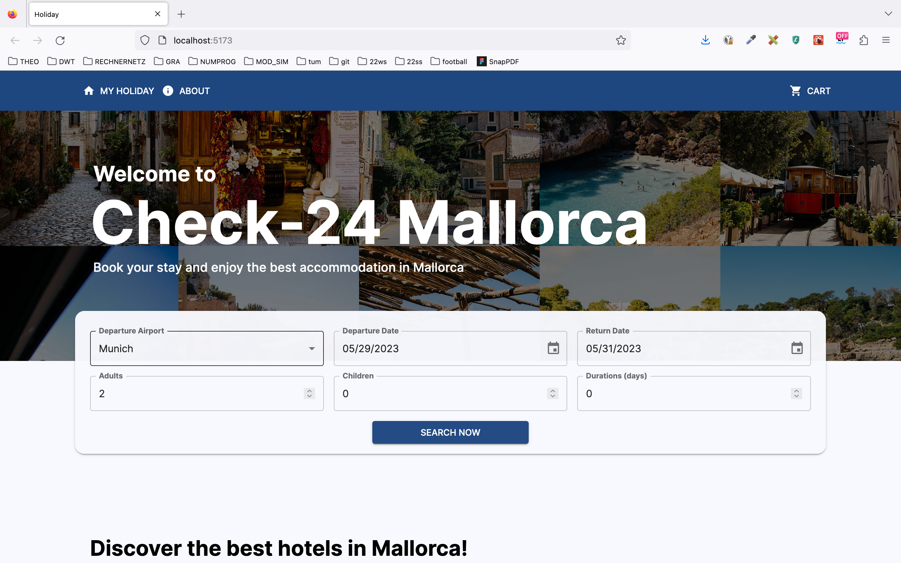
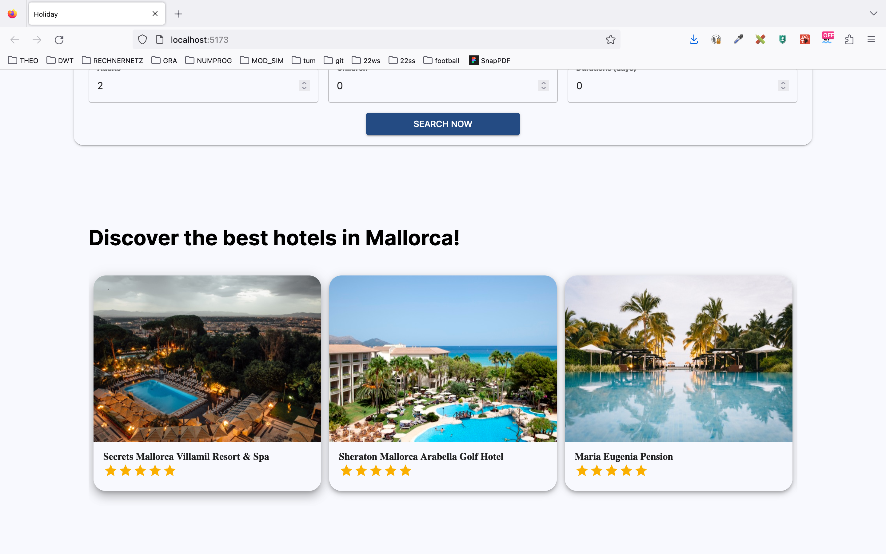
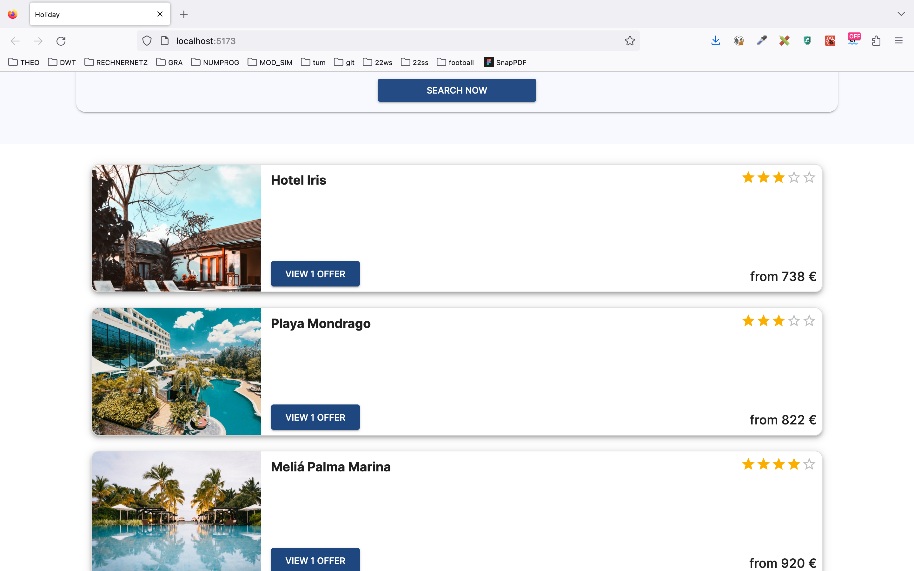
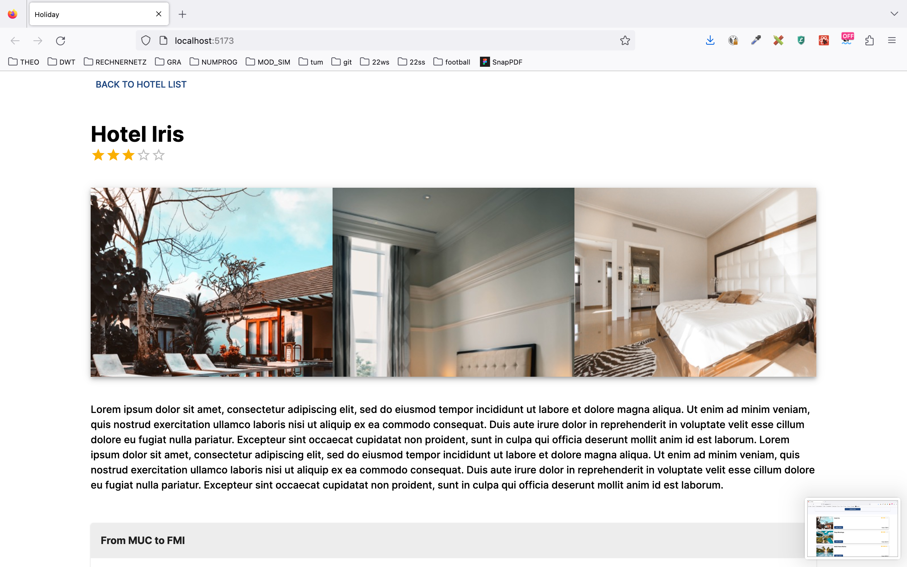
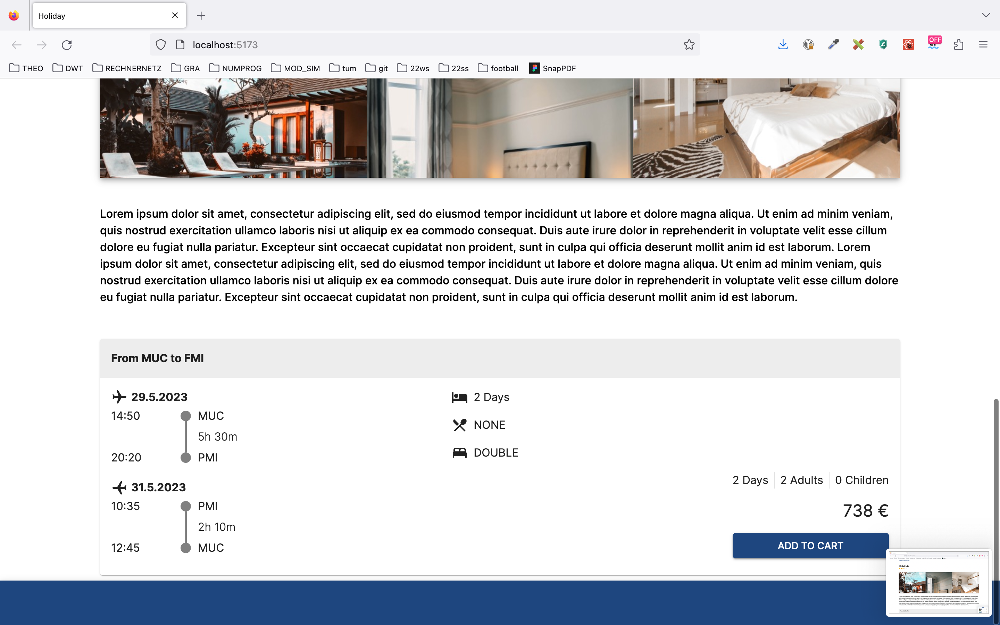
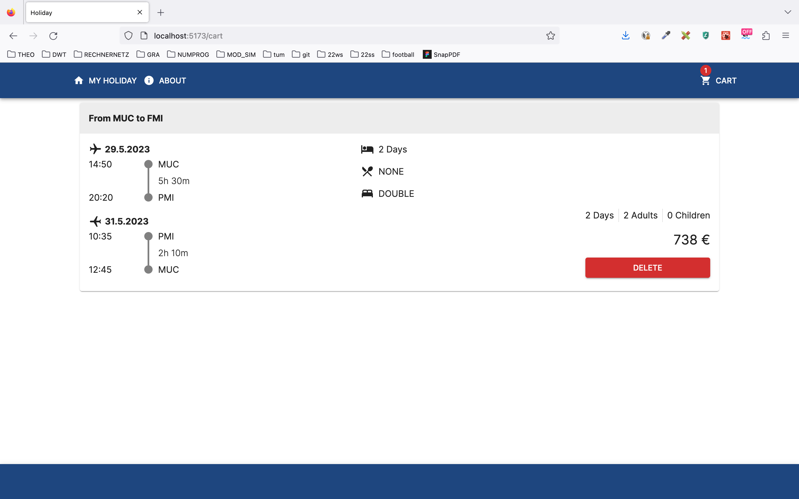

# Check24 Holliday Challenge

## Table of Contents

- [Check24 Holliday Challenge](#check24-holliday-challenge)
  - [Table of Contents](#table-of-contents)
  - [Disclaimer](#disclaimer)
- [Getting started](#getting-started)
  - [Demo](#demo)
  - [Prerequisites](#prerequisites)
    - [For Backend:](#for-backend)
    - [For Frontend:](#for-frontend)
    - [For Data-cleaning](#for-data-cleaning)
  - [How to start](#how-to-start)
    - [1. Clean data](#1-clean-data)
    - [2. Start Backend](#2-start-backend)
    - [3. Start Frontend](#3-start-frontend)
  - [Frameworks and Infrastructure.](#frameworks-and-infrastructure)
    - [Datasets](#datasets)
    - [Backend](#backend)
    - [Frontend](#frontend)
  - [Features](#features)

## Disclaimer

This repository is my personal project for Check24 coding challenge. Copy right of the data (hotels.csv and offers.csv) belongs to Check24. More details could be found [here](https://github.com/check24-scholarships/holiday-challenge).

# Getting started

## Demo

## Prerequisites

To run my app, you'll need the following:

#### For Backend:

- Docker
- Java 20
- Maven

#### For Frontend:

- Node js

#### For Data-cleaning

- Python3/Jupter-Notebook
- Pandas

## How to start

### 1. Clean data

I have cleaned and adapted the given data to optimize the performance of my code. See [Data](#data) for more Details. The actual **data.csv** file in **holiday-backend/src/main/resources/data/** contains only 700000 rows. For starters, you can just run the program without changing anything. Or clean your data like the following:

- Use the given jupyter-notebook script to clean your data.

- Alternatively, you can download the cleaned version [here]().

Replace **data.csv** file in **holiday-backend/src/main/resources/data/**

### 2. Start Backend

In holiday-backend folder, run:

1. `mvn clean install` to install the jar file.

2. `docker-compose up --build` to build docker container and run backend.

If you made any changes inside backend or replace the data, rerun those commands.

### 3. Start Frontend

In holiday-frontend folder, run:

- `npm i` to install all packages.
- `npm run dev` to start the project.

## Frameworks and Infrastructure.

### Datasets

The original offer dataset looks like so:

| hotelid | outbounddeparturedatetime | inbounddeparturedatetime  | countadults | countchildren | price | inbounddepartureairport | inboundarrivalairport | inboundarrivaldatetime    | outbounddepartureairport | outboundarrivalairport | outboundarrivaldatetime   | mealtype  | oceanview | roomtype    |
| ------- | ------------------------- | ------------------------- | ----------- | ------------- | ----- | ----------------------- | --------------------- | ------------------------- | ------------------------ | ---------------------- | ------------------------- | --------- | --------- | ----------- |
| 90      | 2022-10-05T09:30:00+02:00 | 2022-10-12T08:35:00+02:00 | 1           | 1             | 1243  | PMI                     | DUS                   | 2022-10-12T14:40:00+02:00 | DUS                      | PMI                    | 2022-10-05T14:25:00+02:00 | halfboard | FALSE     | double      |
| 1096    | 2022-07-01T11:00:00+02:00 | 2022-07-08T07:30:00+02:00 | 2           | 0             | 1710  | PMI                     | LEJ                   | 2022-07-08T10:00:00+02:00 | LEJ                      | PMI                    | 2022-07-01T13:30:00+02:00 | none      | FALSE     | apartment   |
| 656     | 2022-09-13T15:50:00+02:00 | 2022-09-21T07:50:00+02:00 | 2           | 0             | 2093  | PMI                     | FRA                   | 2022-09-21T10:10:00+02:00 | FRA                      | PMI                    | 2022-09-13T17:55:00+02:00 | breakfast | FALSE     | double      |
| 1880    | 2022-08-07T18:00:00+02:00 | 2022-08-12T08:20:00+02:00 | 2           | 0             | 1707  | PMI                     | MUC                   | 2022-08-12T10:35:00+02:00 | MUC                      | PMI                    | 2022-08-07T20:15:00+02:00 | none      | FALSE     | double      |
| 1190    | 2022-09-20T17:35:00+02:00 | 2022-09-26T07:20:00+02:00 | 2           | 0             | 1866  | PMI                     | SCN                   | 2022-09-26T09:30:00+02:00 | SCN                      | PMI                    | 2022-09-20T19:40:00+02:00 | breakfast | FALSE     | juniorsuite |
| 231     | 2023-06-07T06:25:00+02:00 | 2023-06-13T09:20:00+02:00 | 1           | 0             | 2131  | PMI                     | STR                   | 2023-06-13T11:25:00+02:00 | STR                      | PMI                    | 2023-06-07T08:30:00+02:00 | breakfast | FALSE     | single      |
| 757     | 2022-08-23T05:55:00+02:00 | 2022-08-30T07:50:00+02:00 | 2           | 0             | 1153  | PMI                     | HAM                   | 2022-08-30T10:35:00+02:00 | HAM                      | PMI                    | 2022-08-23T08:40:00+02:00 | none      | FALSE     | apartment   |
| 86      | 2022-08-29T15:10:00+02:00 | 2022-09-02T18:10:00+02:00 | 3           | 0             | 1653  | PMI                     | FDH                   | 2022-09-02T20:20:00+02:00 | FDH                      | PMI                    | 2022-08-29T17:10:00+02:00 | breakfast | FALSE     | triple      |
| 223     | 2022-08-26T17:50:00+02:00 | 2022-08-30T10:00:00+02:00 | 2           | 0             | 980   | PMI                     | STR                   | 2022-08-30T12:10:00+02:00 | STR                      | PMI                    | 2022-08-26T19:50:00+02:00 | breakfast | FALSE     | double      |
| 187     | 2022-08-26T17:50:00+02:00 | 2022-08-30T10:00:00+02:00 | 2           | 0             | 1175  | PMI                     | STR                   | 2022-08-30T12:10:00+02:00 | STR                      | PMI                    | 2022-08-26T19:50:00+02:00 | halfboard | FALSE     | double      |

Since I notice that all the flights are oneway flights to Mallorca (PMI), I found 3 these 3 columns redundant:
**1. inbounddepartureairport**
**2. outboundarrivalairport**
**3. inboundarrivalairport**

Furthermore, the 3 columns
**1. mealtype**
**2. roomtype**
**3. oceanview**

could be merged into one column to save file size and also increase overall performance. So I merged those columns:

| mealtype             | decoded-value | roomtype             | decoded-value | oceanview | decoded-value |
| -------------------- | ------------- | -------------------- | ------------- | --------- | ------------- |
| ACCORDINGDESCRIPTION | A             | ACCORDINGDESCRIPTION | A             | FALSE     | F             |
| ALLINCLUSIVE         | B             | APARTMENT            | B             | TRUE      | T             |
| ALLINCLUSIVEPLUS     | C             | BUNGALOW             | C             |           |               |
| BREAKFAST            | D             | DELUXE               | D             |           |               |
| FULLBOARD            | E             | DOUBLE               | E             |           |               |
| FULLBOARDPLUS        | F             | ECONOMY              | F             |           |               |
| HALFBOARD            | G             | FAMILY               | G             |           |               |
| HALFBOARDPLUS        | H             | FOURBEDROOM          | H             |           |               |
| NONE                 | I             | HOLIDAYHOUSE         | I             |           |               |
|                      |               | JUNIORSUITE          | K             |           |               |
|                      |               | MULTISHARE           | L             |           |               |
|                      |               | SINGLE               | M             |           |               |
|                      |               | STUDIO               | N             |           |               |
|                      |               | SUITE                | O             |           |               |
|                      |               | SUPERIOR             | P             |           |               |
|                      |               | TRIPLE               | Q             |           |               |
|                      |               | TWINROOM             | R             |           |               |
|                      |               | VILLA                | S             |           |               |

into 1 column called **mtr**

| mtr | example                                 |
| --- | --------------------------------------- |
| AAT | ACCORDINGDESCRIPTION + APARTMENT + TRUE |
| ... | ...                                     |

The total size of the csv file was reduced from approximately 20GB to 14GB, while all the information remained.

### Backend

I used Springboot and Model-View-Controller to build an API service with HTTPs methods like get, post, delete method. The Frontend client will interact with Controller part, while Service part holds all the logic of the backend and the Repository part interact directly with a database.

### Frontend

Inspired by the default frontend, I implemented a ReactJs App. With MUI I was able to create a modern, responsive UI. I reused some components and functions from the given code, and improved them with attributes like BorderRadius, BoxShadow, ...

## Features

My web application includes the following features:

- Users can search for a list of all hotels that match the search query.
- Users can view all offers from the chosen hotel.
- Users can add offers to Card
- Users can view all added offers in Cart, and also removes them
